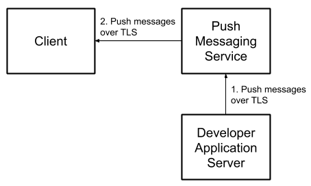
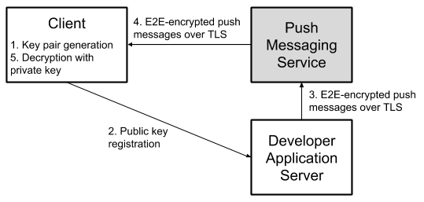

# Capillary

This is an SDK to simplify the sending of end-to-end (E2E) encrypted push messages from Java-based
application servers to Android clients. Please check the instruction below and the [demo](demo) for
more details.

## Installation

TODO: verify dependency paths after publishing artifacts.

To add a dependency using Maven:

- For a Java-based server:
  ```xml
  <dependency>
    <groupId>com.google.capillary</groupId>
    <artifactId>lib</artifactId>
    <version>1.0.0</version>
  </dependency>
  ```

- For Android:
  ```xml
  <dependency>
    <groupId>com.google.capillary</groupId>
    <artifactId>lib-android</artifactId>
    <version>1.0.0</version>
  </dependency>
  ```

To add a dependency using Gradle:

- For a Java-based server:
  ```
  dependencies {
    compile 'com.google.capillary:lib:1.0.0'
  }
  ```
- For Android:
  ```
  dependencies {
    compile 'com.google.capillary:lib-android:1.0.0'
  }
  ```

## Introduction

To use push messaging services to send messages to connected devices, developers must send them
through a third party messaging service, such as
[Firebase Cloud Messaging](https://firebase.google.com/docs/cloud-messaging/) (FCM).
It’s simple to encrypt message contents between the developer and the messaging service using https.
Major messaging services, including [FCM](https://firebase.google.com/docs/cloud-messaging/), also
encrypt messages between their servers and client devices.

However, messages between the developer server and the user devices are not encrypted
end-to-end (E2E):



E2E encryption can be achieved by generating an asymmetric encryption key pair on the client,
registering the public key with the developer messaging service, encrypting outgoing messages with
the public key, and decrypting messages on the client using the private key:



Capillary handles these operations for push messaging services used by Android apps. It includes:

- Crypto functionality and key management across all versions of Android back to
[KitKat](https://www.android.com/versions/kit-kat-4-4/) (API level 19).

- Key generation and registration workflows.

- Message encryption (on the server) and decryption (on the client).

- Integrity protection to prevent message modification.

- Edge-cases, such as users adding/resetting device lock after installing the app, users resetting
app storage, etc.

As a bonus, it also allows developers to require that devices are unlocked before selected messages
can be decrypted. This includes messages on devices using
[File-Based Encryption](https://source.android.com/security/encryption/file-based) (FBE):
encrypted messages are cached in Device Encrypted (DE) storage and message decryption keys are
stored in
[Android keystore](https://developer.android.com/training/articles/keystore.html) requiring
[user authentication](https://developer.android.com/training/articles/keystore#UserAuthentication).
This allows developers to specify messages with sensitive content to remain encrypted in cached form
until the user has unlocked and decrypted their device.

## API Options

### Web Push vs RSA-ECDSA

- Web Push
  
  **Pro:** Follows the [IETF RFC 8290](https://tools.ietf.org/html/rfc8291), therefore allows
  developers to share code and key storage infrastructure with existing Web Push implementations.
  Web Push protocol is based on the Elliptic-curve Diffie-Hellman (ECDH) key exchange algorithm,
  which is highly efficient for performance-constrained devices. Note that apps (as opposed to
  browsers) cannot receive raw Web Push messages through FCM, but Web Push messages can easily be
  wrapped in the appropriate FCM JSON by a proxy implementation, allowing you to use the same
  infrastructure with minor modifications.
  
  **Con:** Android Keystore does not support ECDH key operations. Keys are hybrid-encrypted with an
  RSA key stored in keystore meaning that EC private key plaintext is available in user memory
  during crypto operations.

- RSA-ECDSA
  
  **Pro:** Hybrid-encrypts a message with a client-generated RSA public key (for confidentiality)
  and signs the ciphertext with a developer-generated ECDSA public key (for integrity). RSA crypto
  operations (encrypt, decrypt) are supported by Android Keystore on from SDK 18+ (Jelly Bean),
  meaning key material is not available outside of the trusted execution environment. This means
  even a sophisticated attacker with access to the device memory cannot access private key material
  (for example, to decrypt future messages arriving in Direct Boot mode).
  
  **Con:** Less efficient than ECDH and keys are not compatible with Web Push messaging standard.

### Auth vs NoAuth

Auth bound keys ensures that messages cannot be read by users when their device is locked, meaning
sensitive content will not be readable by shoulder-surfers or if the device is lost or stolen.

## API Overview

Capillary provides the core crypto functionality required to send (from an application server) and
receive encrypted push messages in Android apps. This covers:

- Generating and storing keys on the client.

- Encrypting and signing messages on the server.

- Decrypting and verifying encrypted messages on the client.

- Identifying encrypted messages that should be stored for later if received while the device is
  locked.

Because server-side architectures and push messaging use-cases are many and varied, it is not
practical to provide a server-side API to handle all possible push message implementations.
Therefore, we have decoupled the crypto functionality above from message transmission and
server-side key storage/retrieval functions. We have, however, provided a full-stack implementation
that uses Capillary to send E2E-encrypted push messages from a Java-based server to Android clients
in the demo application. In summary, you will need to implement the following aspects of the
solution yourself (using the demo app and instructions below for guidance where required):

- Registering public keys generated by Capillary with your application server.
- (on server) Indexing the public keys against your users/devices such that you can easily retrieve
  them them to encrypt message.
- Sending messages encrypted using Capillary to devices. Our demo application uses FCM. But
  Capillary can be used with other push messaging services too.
- Passing encrypted push messages to Capillary for decryption.
- Requesting Capillary to decrypt any cached ciphertexts (i.e., those that were received while the
  device was locked) once the device is in an authenticated context (i.e., the users has unlocked
  the screen).
- Displaying or otherwise handling the messages decrypted by Capillary.

## API Integration

TODO: complete the rest...
