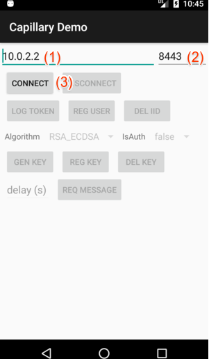
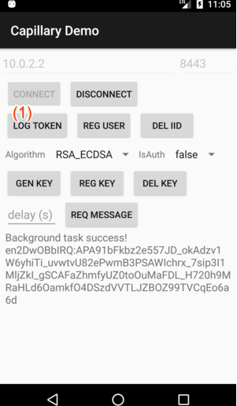
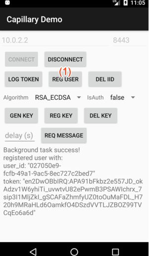
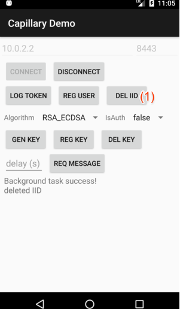
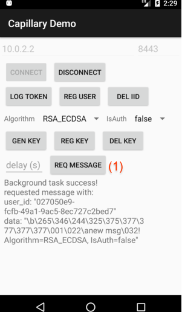
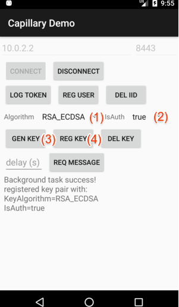
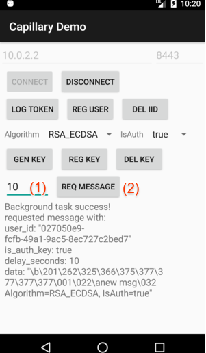
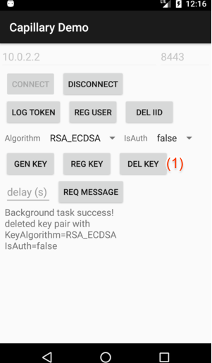

# Capillary Demo

This demo shows how to use Capillary SDK to send end-to-end (E2E) encrypted messages from an
application server to Android clients over [Firebase cloud messaging](https://firebase.google.com/docs/cloud-messaging/)
(FCM). The application server is implemented as a java [gRPC](https://grpc.io/) server. The demo
supports all android versions starting from [KitKat 4.4](https://www.android.com/versions/kit-kat-4-4/)
(API level 19).

Please follow the following instructions to setup and run the demo.

## Prepare Resources

#### Download the demo
```shell
$ git clone https://github.com/google/capillary.git
$ cd capillary/demo
```

#### Initialize Firebase

1. Create a Firebase Android project for the package name `com.google.capillary.demo.android`
([instructions](https://firebase.google.com/docs/android/setup#manually_add_firebase)).
 
1. Download the `google-services.json` file ([instructions](https://support.google.com/firebase/answer/7015592)).

1. Copy the `google-services.json` file to [`android`](android) directory.

1. Generate and download a private key for the Firebase service account ([instructions](https://firebase.google.com/docs/cloud-messaging/auth-server#authorize_http_v1_send_requests)).

1. Rename the downloaded private key as `service-account.json` and copy it to [`resources/firebase`](resources/firebase)
directory.

1. Enable the Firebase Cloud Messaging API on the [Google API Console](https://console.developers.google.com/apis/library/fcm.googleapis.com)

1. Make note of the Project ID in the Firebase project settings page. This ID is referred to as 
`<FIREBASE_PROJECT_ID>` in the instructions below.

#### Initialize ECDSA keys

Use the provided utility program to generate an ECDSA key pair:
```shell
$ cd ..
$ ./gradlew tools:installDist
$ ./tools/build/install/tools/bin/ecdsa-key-pair-generator \
> --ecdsa_public_key_path=demo/android/src/main/res/raw/sender_verification_key.dat \
> --ecdsa_private_key_path=demo/resources/ecdsa/sender_signing_key.dat
$ cd demo
```

#### Initialize TLS keys

The demo supports both RSA-based and Elliptic Curve (EC)-based TLS keys.
To generate EC-based TLS keys:

1. Add the hostname of the server in which the demo application server will be run in the
`[test_sans]` section of the [`resources/tls/init_tls.cnf`](resources/tls/init_tls.cnf) file.
Note that this file already contains the hostnames that are typically used for local development
(`127.0.0.1` for `localhost`, and `10.0.2.2` for connecting to `localhost` from an emulated Android
device [more info](https://developer.android.com/studio/run/emulator-networking.html)).

1. Generate TLS keys:
```shell
$ cd resources/tls
$ openssl req -x509 -days 365 -nodes -newkey ec:<(openssl ecparam -name prime256v1) \
> -keyout tls_tmp.key -out tls.crt -config init_tls.cnf
$ openssl pkcs8 -topk8 -nocrypt -in tls_tmp.key -out tls.key
$ rm tls_tmp.key
$ cp tls.crt ../../android/src/main/res/raw
$ cd ../..
```

See the instructions in [`resources/tls/init_tls.cnf`](resources/tls/init_tls.cnf) to generate
RSA-based TLS keys.

#### Create a SQLite Database

Use the provided schema file to create a demo SQLite database:
```shell
$ cd resources/sqlite
$ sqlite3 demo.db -init demo-schema.sql
sqlite> .quit
$ cd ../..
```

## Run the Server

First, bundle the server into a tarball:
```shell
$ ../gradlew server:distTar
```

At the end of the above process, you will see the tarball of the demo application server at 
`server/build/distributions/server.tar`. Next, copy that tarball and the `resources` directory to a
directory in the server in which the demo application server will be run. Finally, run the server:
```shell
$ tar -xf server.tar
$ ./server/bin/server \
> --port=8443 \
> --firebase_project_id=<FIREBASE_PROJECT_ID> \
> --service_account_credentials_path=resources/firebase/service-account.json \
> --ecdsa_private_key_path=resources/ecdsa/sender_signing_key.dat \
> --tls_cert_path=resources/tls/tls.crt \
> --tls_private_key_path=resources/tls/tls.key \
> --database_path=resources/sqlite/demo.db
```

## Run the Client

```shell
$ ../gradlew android:assembleDebug
$ adb install android/build/outputs/apk/debug/android-debug.apk
```

## Things to Try

#### Register a User

1. Type the hostname (1) and port (2) of the demo application server and click "connect" (3).
   
   

1. Click "log token" (1) to see the current FCM token.
   
   

1. Click "reg user" (1) to generate generate a unique ID that is specific to the current
installation of the demo Android app, and register that ID along with the FCM token at the demo
application server.
   
   

#### Delete the IID

1. Click "del iid" (1) to delete the current FCM instance ID (IID). This results in the FCM SDK
generating a new IID and an FCM token for the demo Android app instance. Observe that the demo 
Android app automatically registers the newly generated FCM token at the demo application server.
   
   

#### Generate & Register Keys

1. Select the algorithm (1) and authentication (2), and click "gen key" (3) to generate a new
Capillary key pair.
   
   
   
   The interaction with the Capillary SDK to generate keys can be summarized as:
   ```java
   Context context = ... // The current app context.
   String keychainId = ... // Some identifier for the key pair.
   boolean isAuth = ... // Whether the private key usage should be guarded by the device lock.
   
   // To generate an RSA-ECDSA key pair.
   InputStream senderVerificationKey = ... // The ECDSA verification key of the server.
   RsaEcdsaKeyManager.getInstance(context, keychainId, senderVerificationKey).generateKeyPair(isAuth);
   
   // To generate a Web Push key pair.
   WebPushKeyManager.getInstance(context, keychainId).generateKeyPair(isAuth);
   ```

1. Click "reg key" (1) to register the generated public key with the demo application server.
   
   
   
   The "reg key" operation consists of two steps:
   1. Obtain the public key from the Capillary SDK. This step can be summarized as:
      ```java
      Context context = ... // The current app context.
      String keychainId = ... // Some identifier for the key pair.
      boolean isAuth = ... // Whether the private key usage should be guarded by the device lock.
      CapillaryHandler handler = ... // An implementation of CapillaryHandler interface.
      Object extra = ... // Any extra information to be passed back to the handler.
      
      // To obtain an RSA-ECDSA public key.
      InputStream senderVerificationKey = ... // The ECDSA verification key of the server.
      RsaEcdsaKeyManager.getInstance(context, keychainId, senderVerificationKey)
          .getPublicKey(isAuth, handler, extra);
      
      // To obtain a Web Push public key.
      WebPushKeyManager.getInstance(context, keychainId).getPublicKey(isAuth, handler, extra);
      
      // The Capillary SDK returns a byte array representing the Capillary public key via the
      // handlePublicKey method of the CapillaryHandler instance.
      ```
   
   1. Send that public key to the demo application server.

#### Send E2E-Encrypted Messages

1. Click "req message" (1) to have the demo application server send an E2E-encrypted message to the
demo Android app.
   
   
   
   The "req message" operation consists of the following steps:
   1. (on client) Request the demo application server to send an E2E-encrypted message.
   
   1. (on server) Generate the E2E-encrypted message as a byte array (ciphertext). This step can
   be summarized as:
      ```java
      byte[] recipientPublicKey = ... // The Capillary public key of the client.
      byte[] message = ... // The message to be sent to the client.
      
      // To create an RSA-ECDSA ciphertext.
      InputStream senderSigningKey = ... // The ECDSA signing key of the server.
      EncrypterManager rsaEcdsaEncrypterManager = new RsaEcdsaEncrypterManager(senderSigningKey);
      rsaEcdsaEncrypterManager.loadPublicKey(recipientPublicKey);
      byte[] ciphertext = rsaEcdsaEncrypterManager.encrypt(message);
      rsaEcdsaEncrypterManager.clearPublicKey();
      
      // To create a Web Push ciphertext.
      EncrypterManager webPushEncrypterManager = new WebPushEncrypterManager();
      webPushEncrypterManager.loadPublicKey(recipientPublicKey);
      byte[] ciphertext = webPushEncrypterManager.encrypt(message);
      webPushEncrypterManager.clearPublicKey();
      ```
   
   1. (on server) send that ciphertext to the demo Android app via FCM.
   
   1. (on client) decrypt the received ciphertext using Capillary SDK. This step can be
   summarized as:
      ```java
      byte[] ciphertext = ... // The ciphertext received through FCM.
      Context context = ... // The current app context.
      String keychainId = ... // Some identifier for the key pair.
      CapillaryHandler handler = ... // An implementation of CapillaryHandler interface.
      Object extra = ... // Any extra information to be passed back to the handler.
      
      // To decrypt an RSA-ECDSA ciphertext.
      InputStream senderVerificationKey = ... // The ECDSA verification key of the server.
      RsaEcdsaKeyManager.getInstance(context, keychainId, senderVerificationKey)
          .getDecrypterManager().decrypt(ciphertext, handler, extra);
      
      // To decrypt a Web Push ciphertext.
      WebPushKeyManager.getInstance(context, keychainId)
          .getDecrypterManager().decrypt(ciphertext, handler, extra);
      
      // The Capillary SDK returns a byte array representing the plaintext via the handleData
      // method of the CapillaryHandler instance.
      ```
   
   1. Display the decrypted message as an notification. 

#### Check Authenticated Keys

One of the main features of the Capillary library is to generate authenticated crypto keys, and
guard the usage of such private keys with a device lock. To try authenticated keys in the demo 
Android app:

1. Make sure the device has a screen lock enabled.

1. Select an algorithm (1), select "IsAuth" as "true" (2), click "gen key" (3), and click "reg key"
(4). This will generate a new authenticated key pair on the device and register the newly generated
public key with the demo application server. 
   
   

1. Request a ciphertext to be sent after some delay. To do so, input a short delay in seconds (1),
say 10 seconds, and click "req message" (2).
   
   

1. Lock the device within the delay that we specified in the previous step.

1. Observe that no demo notification appears in the lock screen after the specified delay has
passed.

1. Unlock the device, and observe that the demo notification appears right after.

What happens behind the scenes after pressing "req message" is the following:

1. The demo Android app requests the demo application server to send an E2E-encrypted message
created with the newly generated public key.

1. The demo application server creates the ciphertext and sends it over FCM after the specified
delay.

1. Notice that the device is now locked. Upon receiving the ciphertext over FCM, the demo Android
app calls the `decrypt` method of the associated
[`DecrypterManager`](../lib-android/src/main/java/com/google/capillary/android/DecrypterManager.java).

1. The Capillary SDK notices that the privated key that is required to decrypt the ciphertext is
authenticated. So, the SDK saves the ciphertext in the demo Android app's local storage to be
decrypted later, and notifies the demo Android app by calling the `authCiphertextSavedForLater`
method of the supplied [`CapillaryHandler`](../lib-android/src/main/java/com/google/capillary/android/CapillaryHandler.java) instance.
Notice that
[`DemoCapillaryHandler`](android/src/main/java/com/google/capillary/demo/android/DemoCapillaryHandler.java),
the demo Android app's implementation of
[`CapillaryHandler`](../lib-android/src/main/java/com/google/capillary/android/CapillaryHandler.java),
merely logs any call to its `authCiphertextSavedForLater` method. But, in real applications, the
developers may want to do other work in this method, e.g., notifying the user that there are 
encrypted messages waiting to be decrypted upon device unlock.

1. The demo Android app waits for the device unlock event using a [`BroadcastReceiver`](https://developer.android.com/reference/android/content/BroadcastReceiver.html)
named [`DeviceUnlockedBroadcastReceiver`](android/src/main/java/com/google/capillary/demo/android/DeviceUnlockedBroadcastReceiver.java).
And, after the user unlocks the device, the demo Android app requests the Capillary SDK to decrypt
any saved ciphertexts. This request to decrypt saved ciphertexts can be summarized as:
   ```java
    Context context = ... // The current app context.
    String keychainId = ... // Some identifier for the key pair.
    CapillaryHandler handler = ... // An implementation of CapillaryHandler interface.
    Object extra = ... // Any extra information to be passed back to the handler.
    
    // To decrypt saved RSA-ECDSA ciphertexts.
    InputStream senderVerificationKey = ... // The ECDSA verification key of the server.
    RsaEcdsaKeyManager.getInstance(context, keychainId, senderVerificationKey)
        .getDecrypterManager().decryptSaved(handler, extra);
    
    // To decrypt saved Web Push ciphertexts.
    WebPushKeyManager.getInstance(context, keychainId)
        .getDecrypterManager().decryptSaved(handler, extra);
    
    // For each decrypted ciphertext, the Capillary SDK returns a byte array representing the
    // plaintext via the handleData method of the CapillaryHandler instance.
   ```

1. The demo Android app then displays the plaintext as a notification.

#### Check Auto Key Generation

The Capillary SDK can resolve most errors with minimal interaction with the client Android apps that
use the SDK. One such error is the corruption of Capillary crypto keys due to the user clearing
the app storage, bugs in the [Android KeyStore](https://doridori.github.io/android-security-the-forgetful-keystore/#sthash.ZQc7htPU.dpbs), etc.
To try this out, do the following:

1. Generate a new key pair (1, 2, 3) and register (4) the public key with the demo application
server.
   
   

1. Delete (1) the key pair from the demo Android app.
   
   

1. Request an E2E-encrypted message (1) from the demo application server, and observe that a demo
notification appears even though the key pair generated earlier has been deleted.
   
   

So, what happens behind the scenes?

1. Upon receiving the ciphertext over FCM, the demo Android app calls the `decrypt` method of the
associated [`DecrypterManager`](../lib-android/src/main/java/com/google/capillary/android/DecrypterManager.java).

1. The Capillary SDK then notices that the private key required to decrypt the ciphertext is missing
(or corrupted). Since there is no way to recover that private key, the SDK then generates a new key
pair with the same algorithm and authentication parameters of the missing key pair.

1. Next, the SDK supplies the newly generated public key to the demo Android app by calling the
overloaded `handlePublicKey` method of the supplied
[`CapillaryHandler`](../lib-android/src/main/java/com/google/capillary/android/CapillaryHandler.java)
instance.
  
1. The [`DemoCapillaryHandler`](android/src/main/java/com/google/capillary/demo/android/DemoCapillaryHandler.java),
the demo Android app's implementation of
[`CapillaryHandler`](../lib-android/src/main/java/com/google/capillary/android/CapillaryHandler.java),
registers that public key with the demo application server and also requests a new E2E-encrypted
message to be sent.

1. The demo Android app receives that ciphertext, and passes it to the Capillary SDK to decrypt.
 
1. SDK successfully decrypts that ciphertext and passes the plaintext back to the demo Android app,
which displays the plaintext as a notification.
